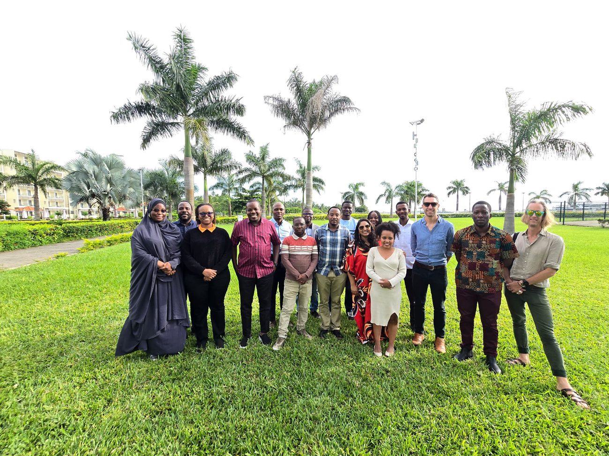
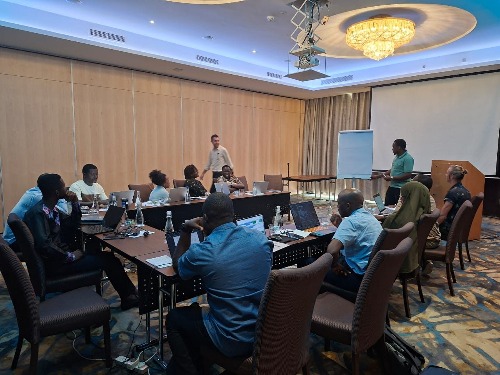
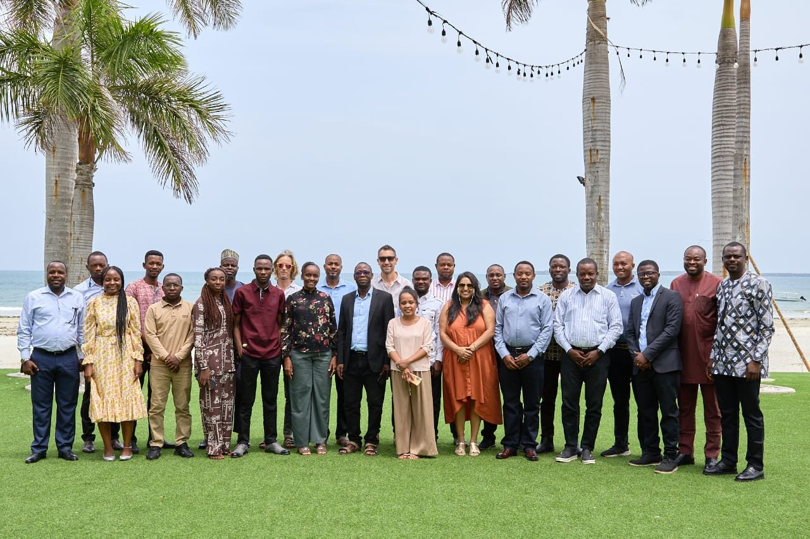
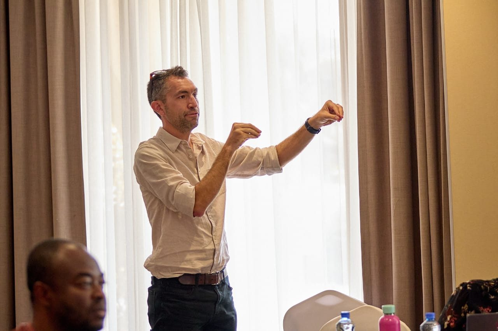
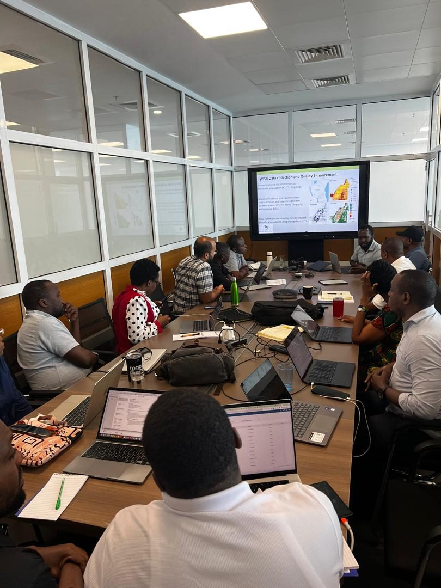
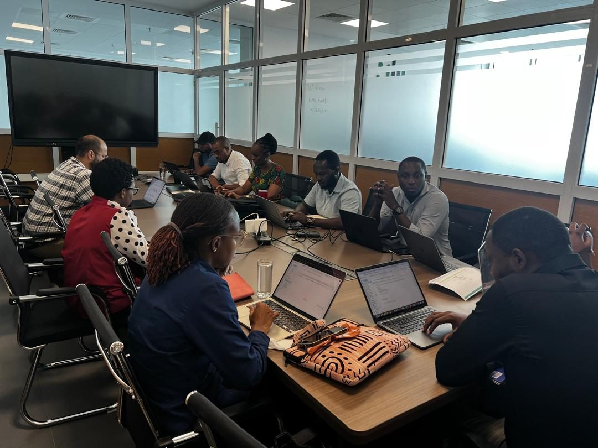
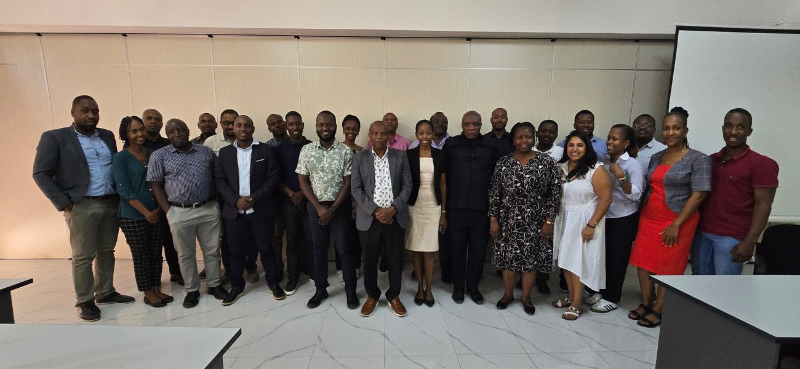
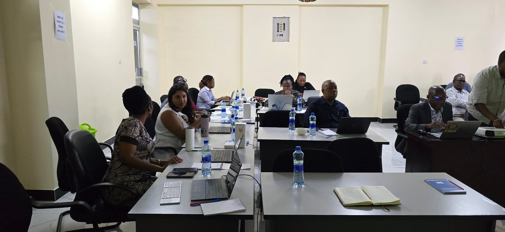
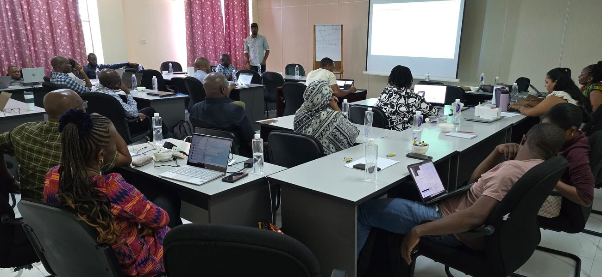
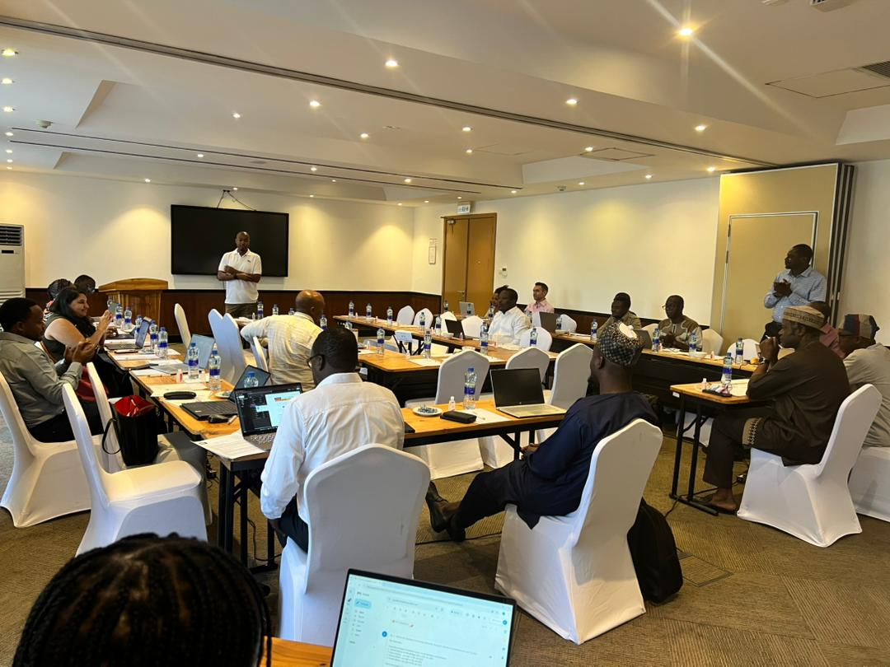

```{=html}
<style>
  .news-slider { position: relative; overflow: hidden; border: 1px solid var(--line); border-radius: 16px; background: #fff; box-shadow: var(--shadow-1); margin-top: 2rem; }
  .news-track { display: flex; transition: transform .5s cubic-bezier(.4,.0,.2,1); }
  .news-slide { flex: 0 0 100%; display: grid; grid-template-columns: 45% 1fr; }
  .news-slide__media { position: relative; min-height: 340px; background: var(--haze); }
  .news-slide__media img { position: absolute; inset: 0; width: 100%; height: 100%; object-fit: cover; opacity: 0; transition: opacity 1.6s ease; display: block; }
  .news-slide__media img.is-active { opacity: 1; }
  .news-slide__body { padding: 2rem 2.3rem; align-self: center; }
  .news-slide__body .date { font-family: "IBM Plex Mono", monospace; font-size: .74rem; letter-spacing: .06em; color: var(--field); }
  .news-slide__body h3 { margin: .5rem 0 .7rem; font-size: 1.35rem; line-height: 1.2; color: var(--ink); }
  .news-slide__body p { color: var(--muted); margin: 0 0 1.1rem; }
  .news-slide__body a.more { font-family: "IBM Plex Mono", monospace; font-size: .82rem; color: var(--field-d); text-decoration: none; }
  .news-slide__body a.more:hover { color: var(--signal); }
  .news-nav { position: absolute; top: 50%; transform: translateY(-50%); z-index: 4; width: 40px; height: 40px; border: 0; border-radius: 50%; background: rgba(15,46,28,.75); color: #fff; font-size: 1.4rem; line-height: 1; cursor: pointer; display: flex; align-items: center; justify-content: center; }
  .news-nav:hover { background: var(--field); }
  .news-prev { left: 12px; } .news-next { right: 12px; }
  .news-dots { position: absolute; bottom: 12px; left: 0; right: 0; display: flex; justify-content: center; gap: 8px; z-index: 4; }
  .news-dot { width: 9px; height: 9px; border-radius: 50%; border: 0; padding: 0; background: rgba(15,46,28,.28); cursor: pointer; }
  .news-dot.is-active { background: var(--field); }
  @media (max-width: 760px) {
    .news-slide { grid-template-columns: 1fr; }
    .news-slide__media { min-height: 220px; }
    .news-slide__body { padding: 1.4rem 1.4rem 2.2rem; }
  }
</style>

<div class="news-slider" data-autoplay="12000">
  <div class="news-track">

    <article class="news-slide">
      <div class="news-slide__media" data-photo-interval="5000">
        
        
      </div>
      <div class="news-slide__body">
        <div class="date">Avril 2026 · Zanzibar, Tanzanie</div>
        <h3>Un hackathon de modélisation réunit les pôles</h3>
        <p>Des groupes de travail réunissant plusieurs pôles ont passé la semaine à relever ensemble des défis techniques communs de la construction d'un pipeline climatique ERA5-et-altitude pour Kinshasa à la modélisation du comportement de piqûre des vecteurs, du microclimat et de la capacité vectorielle transformant les objectifs de collaboration et de renforcement des compétences du réseau en code opérationnel.</p>
      </div>
    </article>

    <article class="news-slide">
      <div class="news-slide__media" data-photo-interval="5000">
        
        
      </div>
      <div class="news-slide__body">
        <div class="date">26–29 janvier 2026 · Dar es Salaam, Tanzanie</div>
        <h3>Réunion annuelle : faire le point et préparer l'année à venir</h3>
        <p>Un an après son lancement, le réseau s'est de nouveau réuni à Dar es Salaam pour faire le bilan des progrès de la première année et fixer les priorités de la suivante — rassemblant responsables pays, chercheurs et partenaires programmatiques de l'ensemble des pôles.</p>
        <a class="more" href="https://ihi.or.tz/our-events/1041/details/">Lire le compte rendu complet sur le site de l'IHI →</a>
      </div>
    </article>

    <article class="news-slide">
      <div class="news-slide__media" data-photo-interval="5000">
        
        
      </div>
      <div class="news-slide__body">
        <div class="date">14 juillet 2025 · Dar es Salaam, Tanzanie</div>
        <h3>Coordonner la modélisation climat-santé en Tanzanie</h3>
        <p>MoDD Africa a rejoint des projets partenaires — le Malaria Atlas Project, l'Université de Dar es Salaam et HISP (DHIS2) pour une journée de travail visant à harmoniser la modélisation climat-santé en Tanzanie : cartographier les activités de chaque projet, élaborer un plan de travail intégré et faire avancer la création d'un groupe de travail technique national sur le climat et la santé avec le NMCP et le ministère de la Santé.</p>
      </div>
    </article>

    <article class="news-slide">
      <div class="news-slide__media" data-photo-interval="5000">
        
        
        
      </div>
      <div class="news-slide__body">
        <div class="date">13–14 février 2025 · Morogoro, Tanzanie</div>
        <h3>Présenter la modélisation climatique aux acteurs de la lutte antipaludique en Tanzanie</h3>
        <p>MoDD Africa et le projet <em>Modelling Climate on Malaria in Tanzania</em> ont présenté leurs travaux au ministère de la Santé, au programme national de lutte contre le paludisme (NMCP) et à des partenaires dont l'Agence météorologique de Tanzanie, l'UDSM et le NM-AIST. En deux jours, le groupe a dressé un tableau commun des enjeux du paludisme et du climat en Tanzanie, exploré de nouveaux outils de données climat-santé et défini les prochaines étapes en matière de partage de données et de comité de pilotage conjoint.</p>
      </div>
    </article>

    <article class="news-slide">
      <div class="news-slide__media">
        
      </div>
      <div class="news-slide__body">
        <div class="date">28–30 novembre 2024 · Nairobi, Kenya</div>
        <h3>Le réseau est lancé lors de sa réunion de lancement des responsables de projet</h3>
        <p>MoDD Africa a officiellement démarré par une réunion de lancement de trois jours à l'ICIPE, à Nairobi, permettant d'accorder l'équipe sur la feuille de route quadriennale et le programme scientifique, et de rendre les pôles opérationnels.</p>
        <a class="more" href="https://www.ihi.or.tz/our-events/610/details/">Lire le compte rendu complet sur le site de l'IHI →</a>
      </div>
    </article>

  </div>
  <button class="news-nav news-prev" aria-label="Précédent">‹</button>
  <button class="news-nav news-next" aria-label="Suivant">›</button>
  <div class="news-dots"></div>
</div>

<script>
(function () {
  var slider = document.querySelector('.news-slider');
  if (!slider) return;
  var reduce = matchMedia('(prefers-reduced-motion: reduce)').matches;

  slider.querySelectorAll('.news-slide__media').forEach(function (m) {
    var ph = m.querySelectorAll('img');
    if (ph.length < 2 || reduce) return;
    var iv = parseInt(m.getAttribute('data-photo-interval'), 10) || 3500;
    var k = 0;
    setInterval(function () {
      ph[k].classList.remove('is-active');
      k = (k + 1) % ph.length;
      ph[k].classList.add('is-active');
    }, iv);
  });

  var track  = slider.querySelector('.news-track');
  var slides = Array.prototype.slice.call(slider.querySelectorAll('.news-slide'));
  var dotsWrap = slider.querySelector('.news-dots');
  var n = slides.length, i = 0, timer = null;
  if (n <= 1) {
    var pv = slider.querySelector('.news-prev'), nx = slider.querySelector('.news-next');
    if (pv) pv.style.display = 'none'; if (nx) nx.style.display = 'none'; return;
  }
  slides.forEach(function (_, k) {
    var d = document.createElement('button');
    d.className = 'news-dot' + (k === 0 ? ' is-active' : '');
    d.setAttribute('aria-label', 'Aller à l\'actualité ' + (k + 1));
    d.addEventListener('click', function () { go(k); reset(); });
    dotsWrap.appendChild(d);
  });
  var dots = dotsWrap.querySelectorAll('.news-dot');
  function go(k) {
    i = (k + n) % n;
    track.style.transform = 'translateX(-' + (i * 100) + '%)';
    dots.forEach(function (d, j) { d.classList.toggle('is-active', j === i); });
  }
  function next() { go(i + 1); } function prev() { go(i - 1); }
  slider.querySelector('.news-next').addEventListener('click', function () { next(); reset(); });
  slider.querySelector('.news-prev').addEventListener('click', function () { prev(); reset(); });
  var delay = parseInt(slider.getAttribute('data-autoplay'), 10) || 0;
  function start() { if (delay && !reduce) timer = setInterval(next, delay); }
  function reset() { clearInterval(timer); start(); }
  slider.addEventListener('mouseenter', function () { clearInterval(timer); });
  slider.addEventListener('mouseleave', start);
  start();
})();
</script>
```
