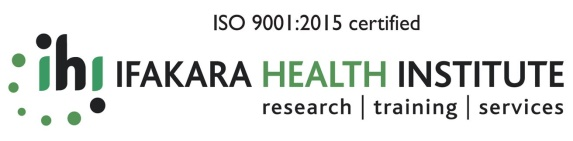
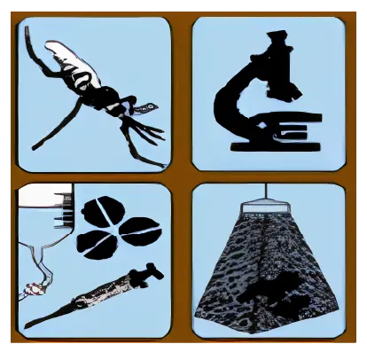
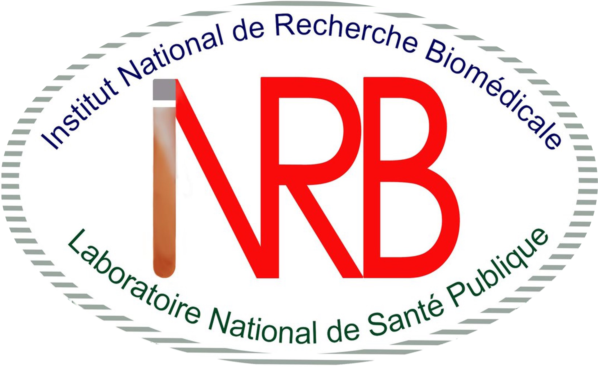
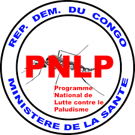
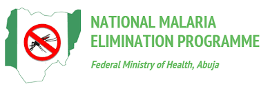

[Collaborateurs]{.eyebrow}

## Travailler avec celles et ceux qui décident

Les modèles n'ont d'utilité que s'ils font évoluer les décisions. C'est pourquoi MoDD Africa repose sur des relations de travail étroites avec les institutions responsables de la lutte antipaludique les instituts nationaux de recherche qui accueillent les pôles, et les **programmes nationaux de lutte contre le paludisme** qui définissent les politiques et mettent en œuvre les interventions sur le terrain.

En Tanzanie, le projet est coordonné par l'**Ifakara Health Institute (IHI)**, qui héberge le bureau régional et le pôle tanzanien, et travaille directement avec le **Programme national du paludisme (NMP)** du pays. Ce partenariat ancre la modélisation dans les priorités réelles des programmes d'où et quand cibler la lutte antivectorielle, à la façon dont les interventions résistent à un climat en évolution et garantit que les résultats soient exploitables là où les décisions se prennent.

À l'échelle du réseau, les pôles entretiennent des liens comparables avec les programmes nationaux et les partenaires de recherche en RDC et au Nigéria, renforcés par une **communauté de pratique** régionale en épidémiologie vectorielle et en modélisation, qui relie modélisateurs, chercheurs et décideurs à mesure que le projet grandit.

[Partenaires]{.eyebrow}

## Institutions

```{=html}
<div class="partners">
  <a href="https://www.ihi.or.tz/" target="_blank" rel="noopener" aria-label="Ifakara Health Institute"></a>
  <a href="https://www.nmcp.go.tz/" target="_blank" rel="noopener" aria-label="National Malaria Programme, Tanzania"></a>
  <a href="https://inrb.net/" target="_blank" rel="noopener" aria-label="Institut National de Recherche Biomédicale"></a>
  <a href="https://pnlprdc.org/" target="_blank" rel="noopener" aria-label="Programme National de Lutte contre le Paludisme, DR Congo"></a>
  <a href="https://uniosun.edu.ng/" target="_blank" rel="noopener" aria-label="OSUN State University"></a>
  <a href="https://nmcp.gov.ng/" target="_blank" rel="noopener" aria-label="National Malaria Elimination Programme, Nigeria"></a>
  <a href="https://www.ox.ac.uk/" target="_blank" rel="noopener" aria-label="Université d'Oxford"></a>
  <a href="https://www.thekids.org.au/" target="_blank" rel="noopener" aria-label="The Kids Research Institute Australia"></a>
  <a href="https://espkinshasa.net/" target="_blank" rel="noopener" aria-label="École de Santé Publique de Kinshasa"></a>
</div>
```
