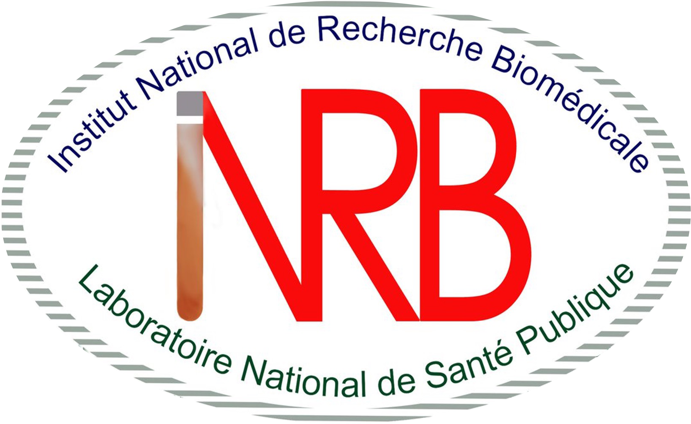
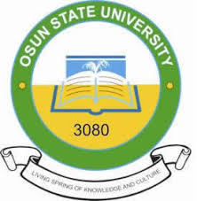
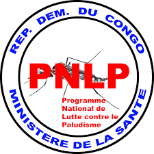
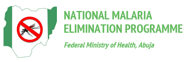
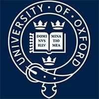
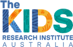

[The network]{.eyebrow}

## Three hubs, one architecture

Each hub builds local modelling capacity while sharing methods, data and lessons across the network. Tanzania coordinates; the DRC and Nigeria anchor the work in different ecological and epidemiological settings.

```{=html}
<div class="hubcards">
  <div class="hubcard">
    
    <div class="hubcard__body">
      <span class="tag">Coordinating hub</span>
      <div class="coord" style="margin-top:.6rem">06°48′S · 39°17′E</div>
      <h3>Tanzania — Ifakara Health Institute</h3>
      <p>Hosts the project as regional coordinator and main recipient of funds, leading efforts to establish the hubs and build regional capacity.</p>
      <p class="hub-lead">Country Lead — Yeromin Mlacha</p>
    </div>
  </div>
  <div class="hubcard">
    
    <div class="hubcard__body">
      <div class="coord">04°19′S · 15°19′E</div>
      <h3>DR Congo — INRB</h3>
      <p>Leads the DRC hub from the National Institute for Biomedical Research (INRB), in one of the highest-burden malaria settings on the continent.</p>
      <p class="hub-lead">Country Lead — Emery Metelo</p>
    </div>
  </div>
  <div class="hubcard">
    
    <div class="hubcard__body">
      <div class="coord">07°46′N · 04°34′E</div>
      <h3>Nigeria — Osun State University</h3>
      <p>Brings the network into West Africa's distinct transmission and health-system context.</p>
      <p class="hub-lead">Country Lead — Adedapo Adeogun</p>
    </div>
  </div>
</div>
```

[Collaborators]{.eyebrow}

## Partners across the network

The hubs work hand in hand with **National Malaria Programmes** — the PNLP in the DRC and the National Malaria Elimination Programme in Nigeria — alongside research and technical partners including the University of Oxford, PATH and the Kids Research Institute Australia. A regional **Community of Practice** in vector epidemiology and modelling connects modellers, researchers and decision-makers as the network grows.

```{=html}
<div class="partners">
  
  
  
  
  
  
  
  
</div>
```