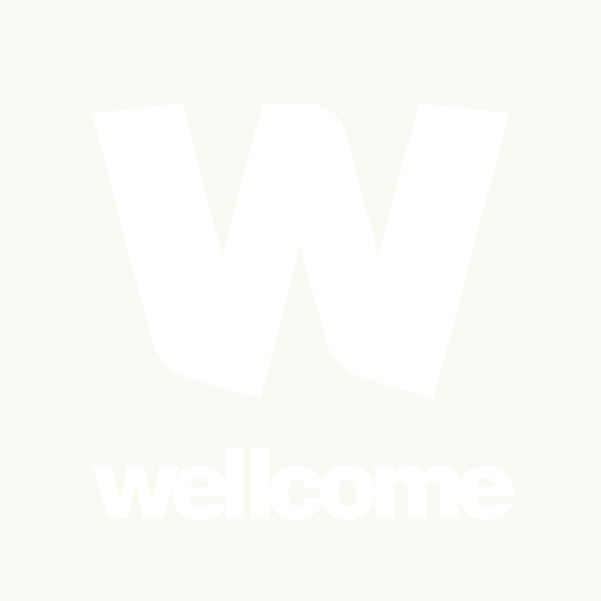

```{=html}
<style>
  #title-block-header { display: none; }
  main#quarto-document-content { padding-top: 0; }
</style>

<!-- ─────────────────────────────  HERO  ───────────────────────────── -->
<section class="hero fullbleed">
  <div class="hero__media">
    
  </div>
  <div class="hero__scrim"></div>
  <div class="wrap">
    <div class="hero__copy">
      <p class="eyebrow eyebrow--light">Wellcome Trust · Nov 2024 – Oct 2028 · TZ / CD / NG</p>
      <h1>Modelling for decisions in a <em>dynamic Africa</em></h1>
      <p class="hero__thesis">Turning environmental, entomological and health data into model-based evidence and forecasts — so malaria programmes can act ahead of a shifting climate.</p>
      <div class="hero__cta">
        <a class="btn-solid" href="project.html">Explore our work <span aria-hidden="true">→</span></a>
        <a class="btn-ghost" href="news.html">Latest news</a>
      </div>
    </div>
  </div>
</section>

<!-- ──────────────────────────  STAT COUNTERS  ─────────────────────── -->
<section class="stats fullbleed">
  <div class="wrap">
    <div class="stat"><div class="num">3</div><div class="lab">Country hubs</div></div>
    <div class="stat"><div class="num">41.8%</div><div class="lab">of global malaria cases</div></div>
    <div class="stat"><div class="num">46.5%</div><div class="lab">of global malaria deaths</div></div>
    <div class="stat"><div class="num">2024–28</div><div class="lab">Funded programme</div></div>
    <p class="stats__note">Malaria burden across the three hub countries · Source: WHO World Malaria Report 2024</p>
  </div>
</section>

<!-- ─────────────────────────────  FUNDER  ─────────────────────────── -->
<section class="funder fullbleed">
  <div class="wrap">
    <div class="funder__text">
      <p class="funder__label">Supported by</p>
      <p>MoDD Africa is funded by the Wellcome Trust (Nov 2024 – Oct 2028) as part of its support for research on climate change and health.</p>
    </div>
    <a class="funder__logo" href="https://wellcome.org" target="_blank" rel="noopener">
      
    </a>
  </div>
</section>
```
