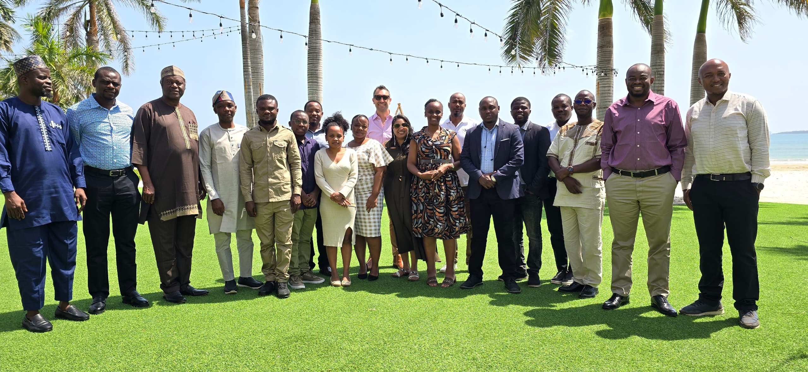
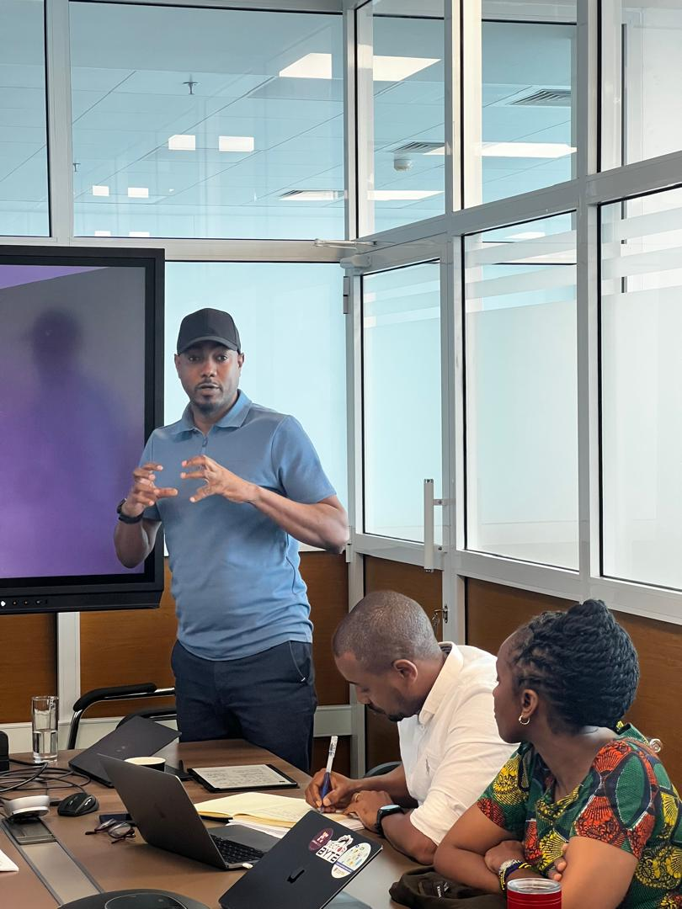
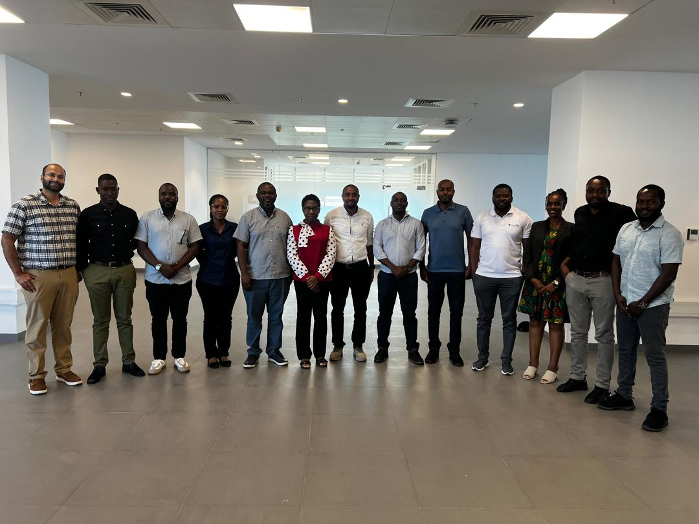
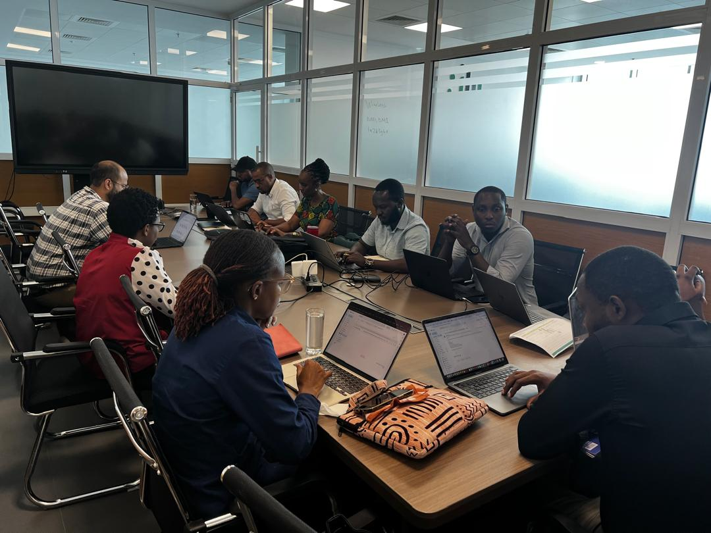
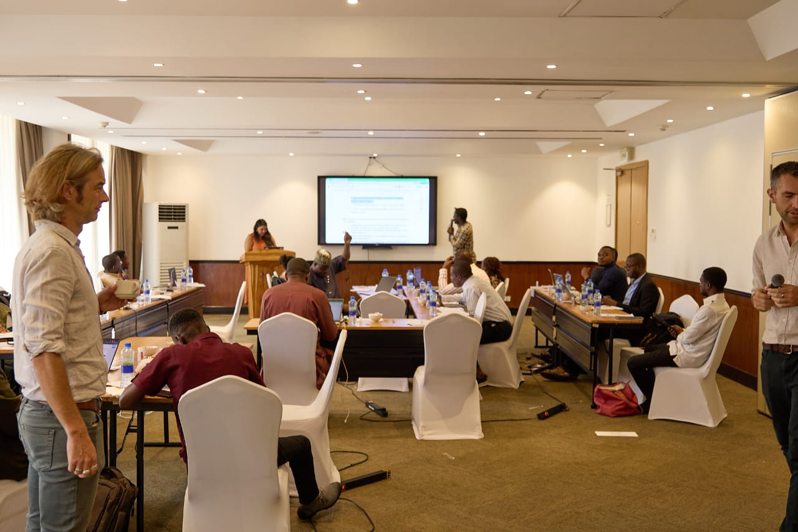
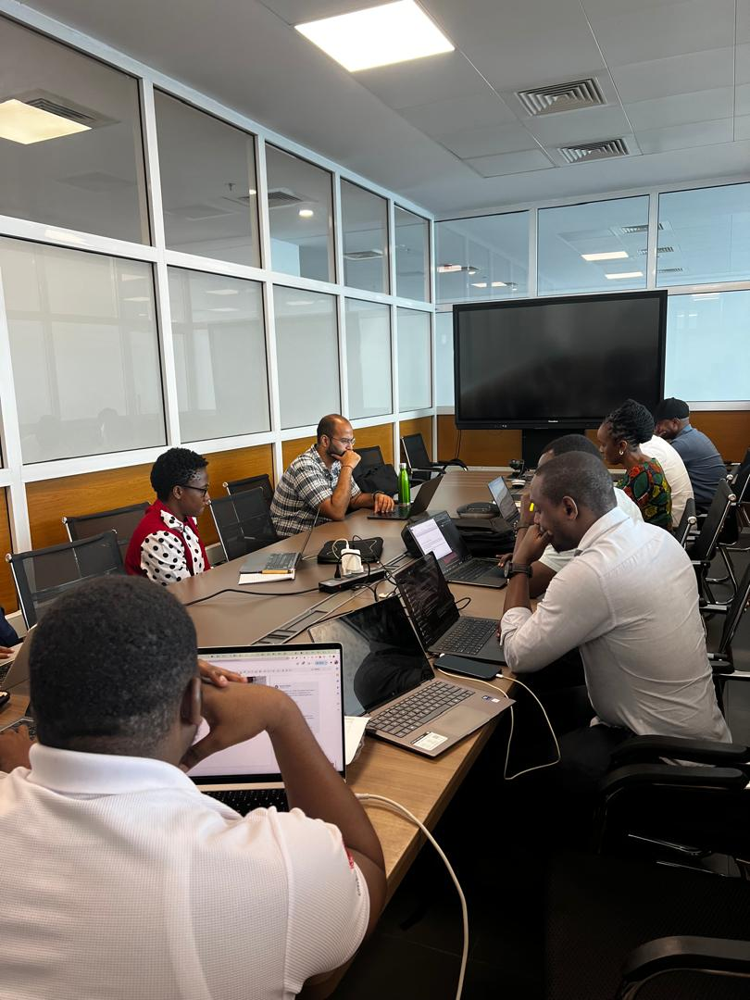

```{=html}
<style>
  /* Home only: drop the default Quarto title block and top gap. */
  #title-block-header { display: none; }
  main#quarto-document-content { padding-top: 0; }
</style>

<!-- ─────────────────────────────  HERO  ───────────────────────────── -->
<section class="hero fullbleed">
  <div class="hero__media">
    
  </div>
  <div class="hero__scrim"></div>
  <div class="wrap">
    <div class="hero__copy">
      <p class="eyebrow eyebrow--light">Wellcome Trust · Nov 2024 – Oct 2028 · TZ / CD / NG</p>
      <h1>Modelling for decisions in a <em>dynamic Africa</em></h1>
      <p class="hero__thesis">Turning environmental, entomological and health data into model-based evidence and forecasts — so malaria programmes can act ahead of a shifting climate.</p>
      <div class="hero__cta">
        <a class="btn-solid" href="project.html">Explore our work <span aria-hidden="true">→</span></a>
        <a class="btn-ghost" href="news.html">Latest news</a>
      </div>
    </div>
  </div>
</section>

<!-- ──────────────────────────  STAT COUNTERS  ─────────────────────── -->
<section class="stats fullbleed">
  <div class="wrap">
    <div class="stat"><div class="num">3</div><div class="lab">Country hubs</div></div>
    <div class="stat"><div class="num">41.8%</div><div class="lab">of global malaria cases</div></div>
    <div class="stat"><div class="num">46.5%</div><div class="lab">of global malaria deaths</div></div>
    <div class="stat"><div class="num">2024–28</div><div class="lab">Funded programme</div></div>
    <p class="stats__note">Malaria burden across the three hub countries · Source: WHO World Malaria Report 2024</p>
  </div>
</section>

<!-- ──────────────────────────  THE CHALLENGE  ─────────────────────── -->
<section class="section">
  <div class="wrap">
    <p class="eyebrow">The challenge</p>
    <h2 class="big">Seeing change before it arrives</h2>
    <p class="section__lede">Africa's climate is shifting where vectors live, how abundant they are and when they peak — and with them the risk of malaria and other mosquito-borne disease. Control programmes need to see those changes coming, not read them after the fact. MoDD Africa builds the models, evidence and forecasting tools that let decision-makers act early and adapt as conditions change.</p>

    <div class="fcards">
      <a class="fcard" href="project.html">
        
        <div class="fcard__body">
          <span class="kicker">Science</span>
          <h3>The Project</h3>
          <p>Background, the ERA modelling architecture, and four work packages from environment to operations.</p>
          <span class="arrow" aria-hidden="true">→</span>
        </div>
      </a>
      <a class="fcard" href="hubs.html">
        
        <div class="fcard__body">
          <span class="kicker">Network</span>
          <h3>Hubs &amp; Partners</h3>
          <p>Modelling hubs in Tanzania, the DRC and Nigeria, working with national malaria programmes.</p>
          <span class="arrow" aria-hidden="true">→</span>
        </div>
      </a>
      <a class="fcard" href="evidence-synthesis.html">
        
        <div class="fcard__body">
          <span class="kicker">Data &amp; code</span>
          <h3>Evidence Synthesis</h3>
          <p>Open, reproducible tooling to collate, analyse and communicate evidence — starting with climate reanalysis.</p>
          <span class="arrow" aria-hidden="true">→</span>
        </div>
      </a>
      <a class="fcard" href="engage.html">
        
        <div class="fcard__body">
          <span class="kicker">People</span>
          <h3>Get Involved</h3>
          <p>Training, hackathons, modelling competitions and a regional community of practice.</p>
          <span class="arrow" aria-hidden="true">→</span>
        </div>
      </a>
    </div>
  </div>
</section>

<!-- ────────────────────────────  THE HUBS  ────────────────────────── -->
<section class="section section--haze fullbleed">
  <div class="wrap">
    <p class="eyebrow">The network</p>
    <h2 class="big">Three hubs, one architecture</h2>
    <p class="section__lede">Each hub builds local modelling capacity while sharing methods, data and lessons across the network. Tanzania coordinates; the DRC and Nigeria anchor the work in different ecological and epidemiological settings.</p>

    <div class="hubcards">
      <div class="hubcard">
        
        <div class="hubcard__body">
          <span class="tag">Coordinating hub</span>
          <div class="coord" style="margin-top:.6rem">06°48′S · 39°17′E</div>
          <h3>Tanzania — Ifakara Health Institute</h3>
          <p>Regional coordinator and main recipient of funds, leading efforts to establish the hubs and build regional capacity.</p>
        </div>
      </div>
      <div class="hubcard">
        
        <div class="hubcard__body">
          <div class="coord">04°19′S · 15°19′E</div>
          <h3>DR Congo — INRB</h3>
          <p>Extends the modelling work to one of the highest-burden malaria settings on the continent.</p>
        </div>
      </div>
      <div class="hubcard">
        
        <div class="hubcard__body">
          <div class="coord">07°46′N · 04°34′E</div>
          <h3>Nigeria — Osun State University</h3>
          <p>Brings the network into West Africa's distinct transmission and health-system context.</p>
        </div>
      </div>
    </div>
  </div>
</section>

<!-- ────────────────────────────  LATEST NEWS  ─────────────────────── -->
<section class="section">
  <div class="wrap">
    <div class="newshead">
      <div>
        <p class="eyebrow">Latest news</p>
        <h2 class="big">From across the network</h2>
      </div>
      <a href="news.html" style="font-family:'IBM Plex Mono',monospace;font-size:.85rem">All news →</a>
    </div>

    <div class="news">
      <a class="post" href="news.html">
        
        <div class="post__body">
          <div class="date">26–29 Jan 2026 · Dar es Salaam</div>
          <h3>Annual meeting: taking stock, planning the year ahead</h3>
          <p>The network reconvened to review year one's progress and set priorities for the next, drawing country leads, researchers and programme partners.</p>
        </div>
      </a>
      <a class="post" href="news.html">
        
        <div class="post__body">
          <div class="date">28–30 Nov 2024 · Nairobi</div>
          <h3>The network launches at its project leads kickoff</h3>
          <p>A three-day kickoff at ICIPE aligned the team on the four-year roadmap, the science agenda and getting the hubs operational.</p>
        </div>
      </a>
    </div>
  </div>
</section>

<!-- ─────────────────────────────  VISION  ─────────────────────────── -->
<section class="vision fullbleed">
  <svg viewBox="0 0 460 380" aria-hidden="true">
    <g stroke="#1E3D2A" stroke-width="1">
      <line x1="60" y1="20" x2="60" y2="360"/><line x1="130" y1="20" x2="130" y2="360"/>
      <line x1="200" y1="20" x2="200" y2="360"/><line x1="270" y1="20" x2="270" y2="360"/>
      <line x1="340" y1="20" x2="340" y2="360"/><line x1="410" y1="20" x2="410" y2="360"/>
      <line x1="30" y1="60" x2="440" y2="60"/><line x1="30" y1="130" x2="440" y2="130"/>
      <line x1="30" y1="200" x2="440" y2="200"/><line x1="30" y1="270" x2="440" y2="270"/><line x1="30" y1="340" x2="440" y2="340"/>
    </g>
    <line x1="150" y1="95" x2="205" y2="215" stroke="#2F7350" stroke-width="1.4"/>
    <line x1="150" y1="95" x2="330" y2="250" stroke="#459A6B" stroke-width="1.8"/>
    <line x1="205" y1="215" x2="330" y2="250" stroke="#459A6B" stroke-width="1.8"/>
    <circle cx="150" cy="95" r="5" fill="#6FC295"/>
    <circle cx="205" cy="215" r="5" fill="#6FC295"/>
    <circle cx="330" cy="250" r="6" fill="#E0743A"/>
  </svg>
  <div class="wrap">
    <p class="eyebrow eyebrow--light">The vision</p>
    <p class="pull">Model-based evidence, advice and forecasting — built in Africa, for Africa's public-health decisions.</p>
  </div>
</section>
```
