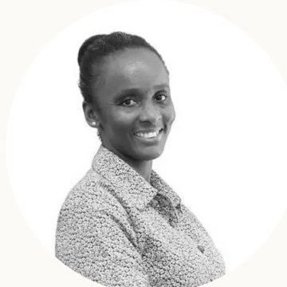
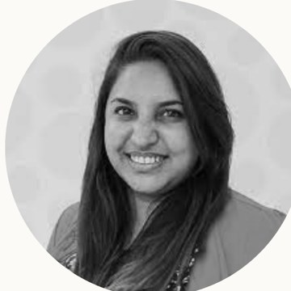
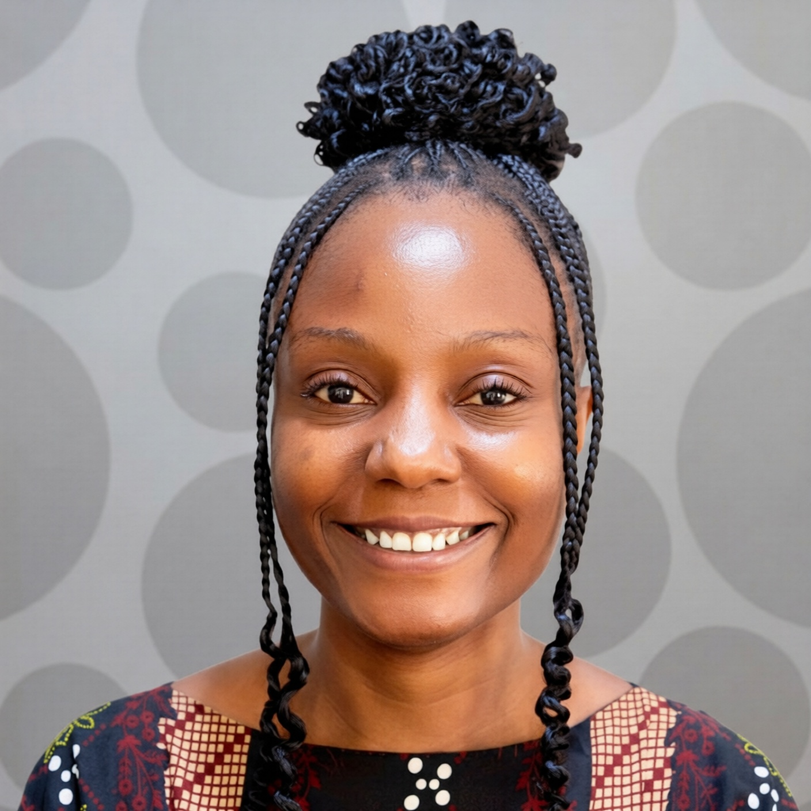
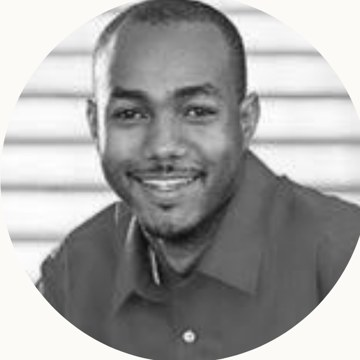
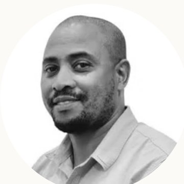
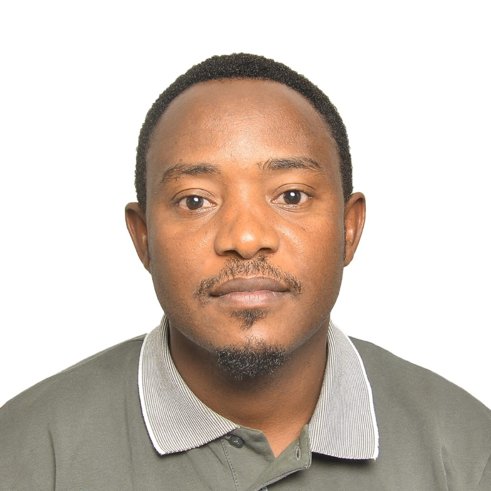
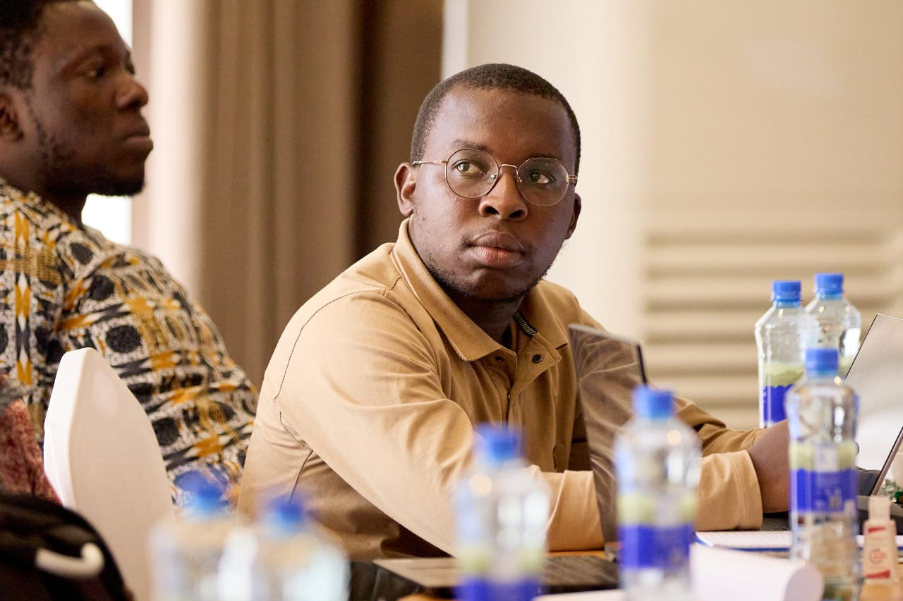
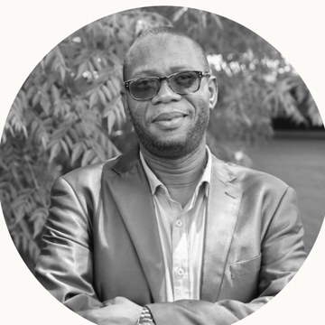
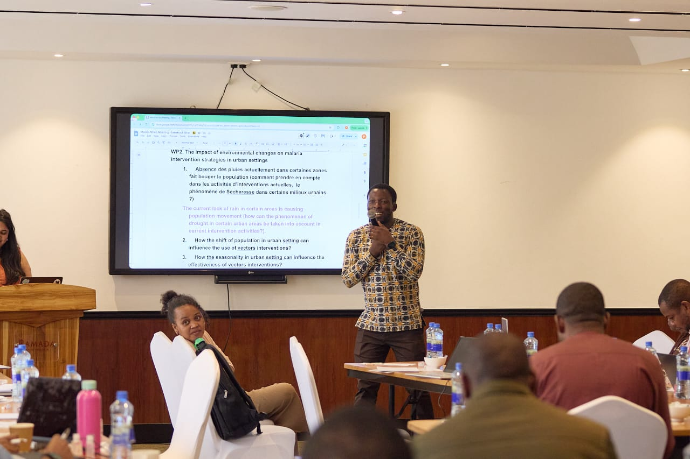
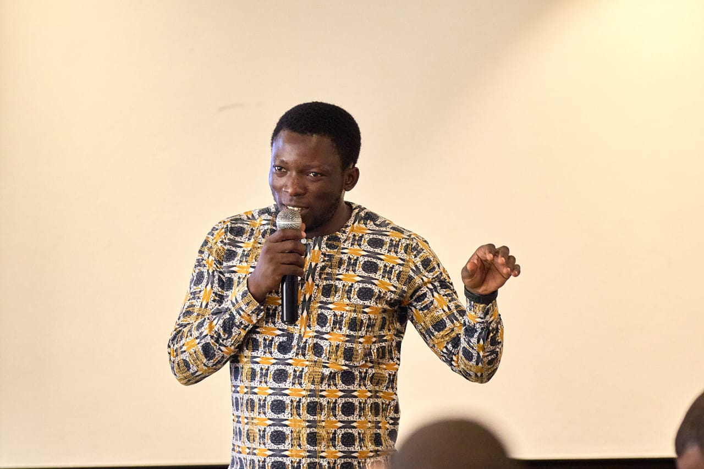

```{=html}
<style>
  .team--lead { grid-template-columns: minmax(240px, 340px); justify-content: center; }
  .person--lead .avatar { width: 120px; height: 120px; font-size: 2rem; }
  .team-filter { display: flex; flex-wrap: wrap; gap: .5rem; margin: 1.6rem 0 0; }
  .team-filter button { font-family: "IBM Plex Mono", monospace; font-size: .76rem; letter-spacing: .04em; padding: .5rem 1.05rem; border-radius: 999px; border: 1px solid var(--line); background: #fff; color: var(--muted); cursor: pointer; transition: all .15s ease; }
  .team-filter button:hover { border-color: var(--field); color: var(--field-d); }
  .team-filter button.is-active { background: var(--field); border-color: var(--field); color: #fff; }
  .team-grid .person[hidden] { display: none; }
</style>
```

[Coordination]{.eyebrow}

## Leadership

```{=html}
<div class="team team--lead">
  <div class="person person--lead">
    
    <h3>Dr. Susan Rumisha</h3>
    <p class="role">Team Lead</p>
    <p class="org">Ifakara Health Institute</p>
  </div>
</div>
```

[The team]{.eyebrow}

## Our people

```{=html}
<div class="team-filter">
  <button data-group="all" class="is-active">All</button>
  <button data-group="regional">Regional office</button>
  <button data-group="tanzania">Tanzania</button>
  <button data-group="drc">DR Congo</button>
  <button data-group="nigeria">Nigeria</button>
</div>

<div class="team team-grid">

  <div class="person" data-group="regional">
    
    <h3>Dr. Punam Amratia</h3><p class="role">Technical Lead</p>
  </div>
  <div class="person" data-group="regional">
    
    <h3>Sosthenes Ketende</h3><p class="role">Program Manager</p>
  </div>
  <div class="person" data-group="regional">
    
    <h3>Diana Mwanamboka</h3><p class="role">Project Administrator</p>
  </div>
  <div class="person" data-group="regional">
    
    <h3>Dr. Samson Kiware</h3><p class="role">Mathematical Modelling Lead</p>
  </div>

  <div class="person" data-group="tanzania">
    
    <h3>Dr. Yeromin Mlacha</h3><p class="role">Hub Lead</p><p class="org">Tanzania</p>
  </div>
  <div class="person" data-group="tanzania">
    
    <h3>Dr. Lembris Njoto</h3><p class="role">Senior Modeller</p><p class="org">Tanzania</p>
  </div>
  <div class="person" data-group="tanzania">
    
    <h3>Kaiza Ilomo</h3><p class="role">Evidence Synthesis Lead</p><p class="org">Tanzania</p>
  </div>

  <div class="person" data-group="drc">
    
    <h3>Prof. Emery Metelo</h3><p class="role">Hub Lead</p><p class="org">DR Congo</p>
  </div>
  <div class="person" data-group="drc">
    <div class="avatar">RY</div>
    <h3>Rodriguez Yombo</h3><p class="role">Senior Modeller</p><p class="org">DR Congo</p>
  </div>
  <div class="person" data-group="drc">
    <div class="avatar">AB</div>
    <h3>Arsene Bokulu</h3><p class="role">Evidence Synthesis Lead</p><p class="org">DR Congo</p>
  </div>

  <div class="person" data-group="nigeria">
    
    <h3>Dr. Adedapo Adeogun</h3><p class="role">Hub Lead</p><p class="org">Nigeria</p>
  </div>
  <div class="person" data-group="nigeria">
    <div class="avatar">TA</div>
    <h3>Taiwo Adekunle</h3><p class="role">Senior Modeller</p><p class="org">Nigeria</p>
  </div>
  <div class="person" data-group="nigeria">
    <div class="avatar">AB</div>
    <h3>Ayodele Babalola</h3><p class="role">Senior Modeller</p><p class="org">Nigeria</p>
  </div>

</div>

<script>
(function () {
  const bar = document.querySelector('.team-filter');
  if (!bar) return;
  const cards = document.querySelectorAll('.team-grid .person');
  bar.addEventListener('click', function (e) {
    const btn = e.target.closest('button');
    if (!btn) return;
    bar.querySelectorAll('button').forEach(function (b) { b.classList.remove('is-active'); });
    btn.classList.add('is-active');
    const g = btn.dataset.group;
    cards.forEach(function (c) { c.hidden = (g !== 'all' && c.dataset.group !== g); });
  });
})();
</script>
```

[The network]{.eyebrow}

## The hubs

Each hub builds local modelling capacity while sharing methods, data and lessons across the network. Tanzania coordinates; the DRC and Nigeria anchor the work in different ecological and epidemiological settings.

```{=html}
<div class="hubcards">
  <div class="hubcard">
    
    <div class="hubcard__body">
      <span class="tag">Coordinating hub</span>
      <h3>Tanzania — Ifakara Health Institute</h3>
      <p>Hosts the project as regional coordinator and main recipient of funds, leading efforts to establish the hubs and build regional capacity.</p>
    </div>
  </div>
  <div class="hubcard">
    
    <div class="hubcard__body">
      <h3>DR Congo — INRB</h3>
      <p>Runs the DRC hub from the National Institute for Biomedical Research (INRB), in one of the highest-burden malaria settings on the continent.</p>
    </div>
  </div>
  <div class="hubcard">
    
    <div class="hubcard__body">
      <h3>Nigeria — NIMR</h3>
      <p>Runs the Nigeria hub from the Nigerian Institute of Medical Research (NIMR), bringing the network into West Africa's distinct transmission and health-system context.</p>
    </div>
  </div>
</div>
```
