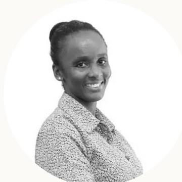
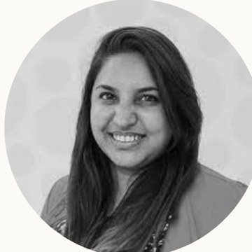
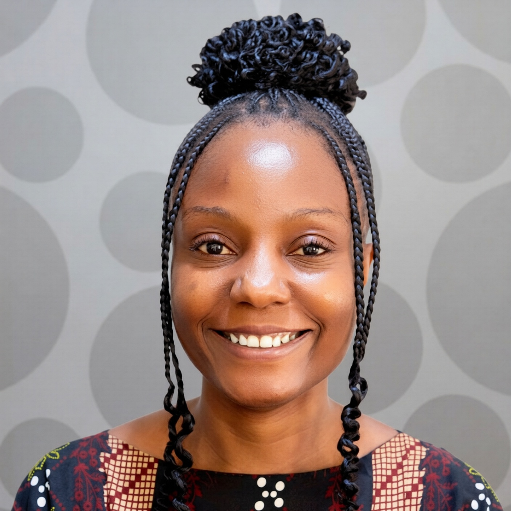
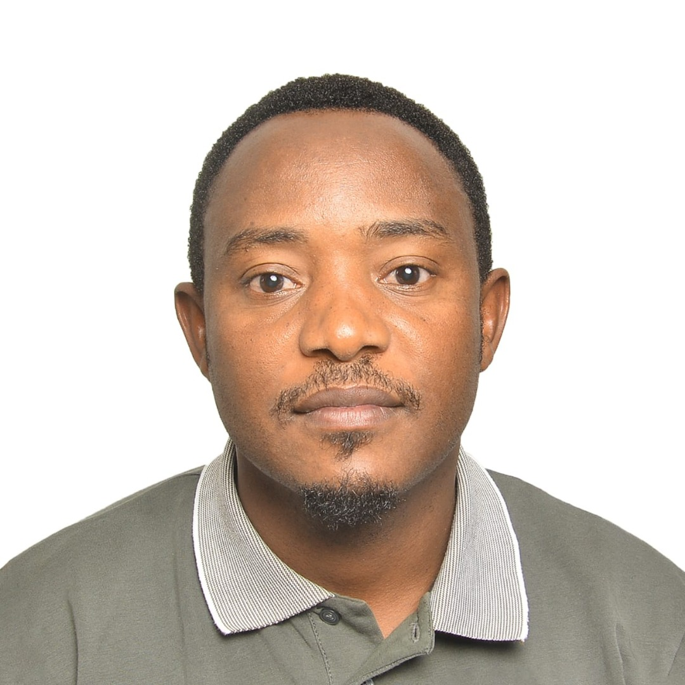
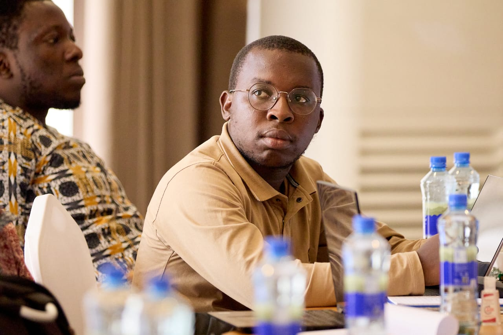
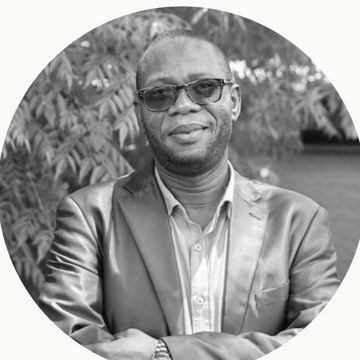
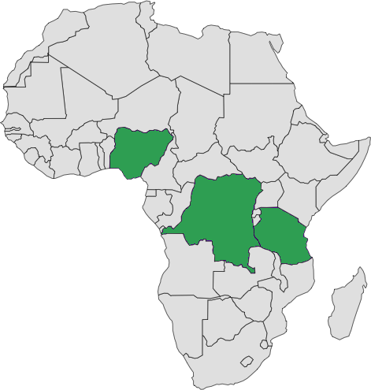
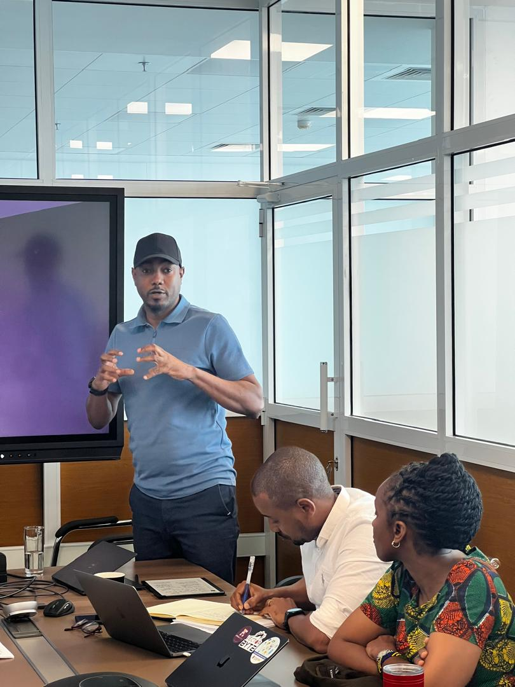
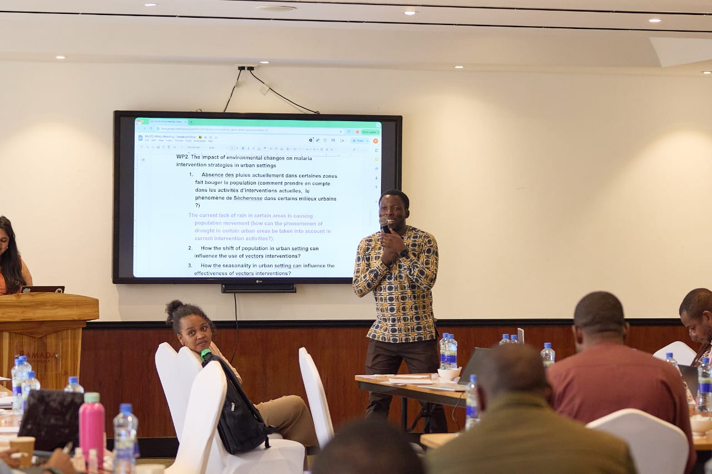
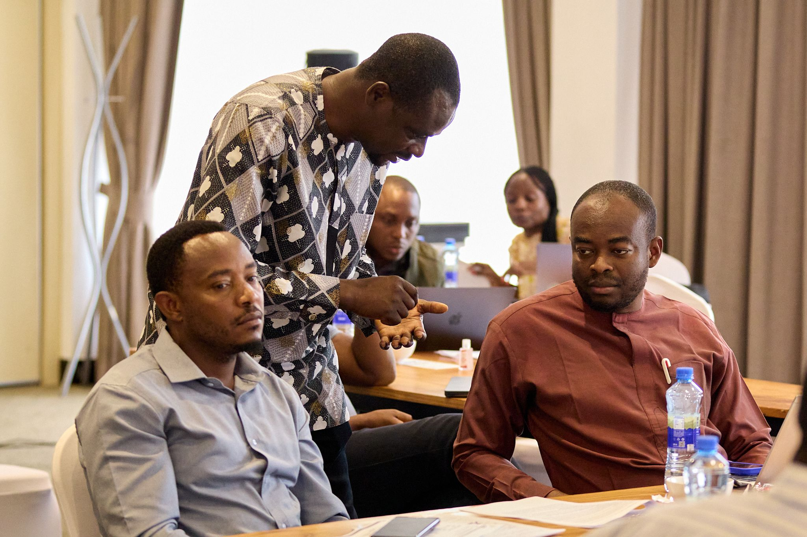

```{=html}
<style>
  .team--lead { grid-template-columns: minmax(240px, 340px); justify-content: center; }
  .person--lead .avatar { width: 120px; height: 120px; font-size: 2rem; }
  .team-filter { display: flex; flex-wrap: wrap; gap: .5rem; margin: 1.6rem 0 0; }
  .team-filter button { font-family: "IBM Plex Mono", monospace; font-size: .76rem; letter-spacing: .04em; padding: .5rem 1.05rem; border-radius: 999px; border: 1px solid var(--line); background: #fff; color: var(--muted); cursor: pointer; transition: all .15s ease; }
  .team-filter button:hover { border-color: var(--field); color: var(--field-d); }
  .team-filter button.is-active { background: var(--field); border-color: var(--field); color: #fff; }
  .team-grid .person[hidden] { display: none; }
</style>
```

[Coordination]{.eyebrow}

## Leadership

```{=html}
<div class="team team--lead">
  <div class="person person--lead">
    
    <h3><a href="https://ihi.or.tz/our-staff/238/Dr.%20Susan/Rumisha/details/" target="_blank" rel="noopener">Dr. Susan Rumisha</a></h3>
    <p class="role">Team Lead</p>
    <p class="org">Ifakara Health Institute</p>
  </div>
</div>
```

[The team]{.eyebrow}

## Our people

```{=html}
<div class="team-filter">
  <button data-group="all" class="is-active">All</button>
  <button data-group="regional">Regional office</button>
  <button data-group="tanzania">Tanzania</button>
  <button data-group="drc">DR Congo</button>
  <button data-group="nigeria">Nigeria</button>
</div>

<div class="team team-grid">

  <div class="person" data-group="regional">
    
    <h3><a href="https://www.ihi.or.tz/our-staff/380/Dr%20Punam/Amratia/details/" target="_blank" rel="noopener">Dr. Punam Amratia</a></h3><p class="role">Technical Lead</p>
  </div>
  <div class="person" data-group="regional">
    
    <h3><a href="https://ihi.or.tz/our-staff/239/Sosthenes/Charles%20Ketende/details/" target="_blank" rel="noopener">Sosthenes Ketende</a></h3><p class="role">Program Manager</p>
  </div>
  <div class="person" data-group="regional">
    
    <h3>Diana Mwanamboka</h3><p class="role">Project Administrator</p>
  </div>
  <div class="person" data-group="regional">
    
    <h3><a href="https://ihi.or.tz/our-staff/301/Dr%20Samson/Kiware/details/" target="_blank" rel="noopener">Dr. Samson Kiware</a></h3><p class="role">Mathematical Modelling Lead</p>
  </div>

  <div class="person" data-group="tanzania">
    
    <h3><a href="https://ihi.or.tz/our-staff/244/Dr.%20Yeromin/Mlacha/details/" target="_blank" rel="noopener">Dr. Yeromin Mlacha</a></h3><p class="role">Hub Lead</p><p class="org">Tanzania</p>
  </div>
  <div class="person" data-group="tanzania">
    
    <h3>Dr. Lembris Njoto</h3><p class="role">Senior Modeller</p><p class="org">Tanzania</p>
  </div>
  <div class="person" data-group="tanzania">
    
    <h3>Kaiza Ilomo</h3><p class="role">Evidence Synthesis Lead</p><p class="org">Tanzania</p>
  </div>

  <div class="person" data-group="drc">
    
    <h3>Prof. Emery Metelo</h3><p class="role">Hub Lead</p><p class="org">DR Congo</p>
  </div>
  <div class="person" data-group="drc">
    <div class="avatar">RY</div>
    <h3>Rodriguez Yombo</h3><p class="role">Senior Modeller</p><p class="org">DR Congo</p>
  </div>
  <div class="person" data-group="drc">
    
    <h3>Arsene Bokulu</h3><p class="role">Evidence Synthesis Lead</p><p class="org">DR Congo</p>
  </div>

  <div class="person" data-group="nigeria">
    
    <h3>Dr. Adedapo Adeogun</h3><p class="role">Hub Lead</p><p class="org">Nigeria</p>
  </div>
  <div class="person" data-group="nigeria">
    
    <h3>Taiwo Adekunle</h3><p class="role">Senior Modeller</p><p class="org">Nigeria</p>
  </div>
  <div class="person" data-group="nigeria">
    
    <h3>Ayodele Babalola</h3><p class="role">Senior Modeller</p><p class="org">Nigeria</p>
  </div>

</div>

<script>
(function () {
  const bar = document.querySelector('.team-filter');
  if (!bar) return;
  const cards = document.querySelectorAll('.team-grid .person');
  bar.addEventListener('click', function (e) {
    const btn = e.target.closest('button');
    if (!btn) return;
    bar.querySelectorAll('button').forEach(function (b) { b.classList.remove('is-active'); });
    btn.classList.add('is-active');
    const g = btn.dataset.group;
    cards.forEach(function (c) { c.hidden = (g !== 'all' && c.dataset.group !== g); });
  });
})();
</script>
```

[The network]{.eyebrow}

## The hubs

```{=html}
<div class="hubs-intro">
  <div>
    <p>Each hub builds local modelling capacity while sharing methods, data and lessons across the network. Tanzania coordinates; the DRC and Nigeria anchor the work in different ecological and epidemiological settings.</p>
  </div>
  <div class="hubs-map-wrap">
    
    <button class="hub-pin" type="button" data-group="nigeria" style="left:40%; top:35%" aria-expanded="false"><span class="hub-pin__dot"></span><span class="hub-pin__label">Nigeria</span></button>
    <button class="hub-pin" type="button" data-group="drc" style="left:57%; top:59%" aria-expanded="false"><span class="hub-pin__dot"></span><span class="hub-pin__label">DR Congo</span></button>
    <button class="hub-pin" type="button" data-group="tanzania" style="left:72%; top:61%" aria-expanded="false"><span class="hub-pin__dot"></span><span class="hub-pin__label">Tanzania</span></button>
    <div class="hub-popover" hidden>
      <button class="hub-popover__close" type="button" aria-label="Close">&times;</button>
      <div class="hub-popover__head"></div>
      <div class="hub-popover__people"></div>
    </div>
  </div>
</div>
<div class="hubcards">
  <div class="hubcard">
    
    <div class="hubcard__body">
      <span class="tag">Coordinating hub</span>
      <h3>Tanzania — Ifakara Health Institute</h3>
      <p>Hosts the project as regional coordinator and main recipient of funds, leading efforts to establish the hubs and build regional capacity.</p>
    </div>
  </div>
  <div class="hubcard">
    
    <div class="hubcard__body">
      <h3>DR Congo — INRB</h3>
      <p>Runs the DRC hub from the National Institute for Biomedical Research (INRB), in one of the highest-burden malaria settings on the continent.</p>
    </div>
  </div>
  <div class="hubcard">
    
    <div class="hubcard__body">
      <h3>Nigeria — NIMR</h3>
      <p>Runs the Nigeria hub from the Nigerian Institute of Medical Research (NIMR), bringing the network into West Africa's distinct transmission and health-system context.</p>
    </div>
  </div>
</div>

<script>
(function () {
  const wrap = document.querySelector('.hubs-map-wrap');
  if (!wrap) return;
  const pins = wrap.querySelectorAll('.hub-pin');
  const pop = wrap.querySelector('.hub-popover');
  const head = pop.querySelector('.hub-popover__head');
  const list = pop.querySelector('.hub-popover__people');
  const closeBtn = pop.querySelector('.hub-popover__close');
  const HUB_LABEL = { nigeria: 'Nigeria hub', drc: 'DR Congo hub', tanzania: 'Tanzania hub' };
  let activePin = null;

  function closePopover() {
    pop.hidden = true;
    if (activePin) { activePin.classList.remove('is-active'); activePin.setAttribute('aria-expanded', 'false'); }
    activePin = null;
  }

  function openPopover(pin) {
    const group = pin.dataset.group;
    const people = document.querySelectorAll('.team-grid .person[data-group="' + group + '"]');
    list.innerHTML = '';
    people.forEach(function (p) {
      const img = p.querySelector('img.avatar');
      const initials = p.querySelector('div.avatar');
      const name = p.querySelector('h3') ? p.querySelector('h3').textContent : '';
      const role = p.querySelector('.role') ? p.querySelector('.role').textContent : '';
      const row = document.createElement('div');
      row.className = 'hub-popover__person';
      const avatarHtml = img ? '' : '<div class="avatar-sm">' + (initials ? initials.textContent : '') + '</div>';
      row.innerHTML = avatarHtml + '<div><h4>' + name + '</h4><p>' + role + '</p></div>';
      list.appendChild(row);
    });
    head.textContent = HUB_LABEL[group] || group;

    pins.forEach(function (p) { p.classList.remove('is-active'); p.setAttribute('aria-expanded', 'false'); });
    pin.classList.add('is-active');
    pin.setAttribute('aria-expanded', 'true');
    activePin = pin;
    pop.hidden = false;

    pop.style.left = '0px';
    pop.style.top = '0px';
    const wrapRect = wrap.getBoundingClientRect();
    const pinRect = pin.getBoundingClientRect();
    const popRect = pop.getBoundingClientRect();
    let left = (pinRect.left - wrapRect.left) - popRect.width / 2 + pinRect.width / 2;
    const top = (pinRect.bottom - wrapRect.top) + 14;
    const minLeft = -(wrapRect.left) + 8;
    const maxLeft = (window.innerWidth - wrapRect.left) - popRect.width - 8;
    left = Math.max(minLeft, Math.min(left, maxLeft));
    pop.style.left = left + 'px';
    pop.style.top = top + 'px';
  }

  pins.forEach(function (pin) {
    pin.addEventListener('click', function (e) {
      e.stopPropagation();
      if (activePin === pin) { closePopover(); return; }
      openPopover(pin);
    });
  });
  closeBtn.addEventListener('click', closePopover);
  document.addEventListener('click', function (e) { if (!pop.hidden && !wrap.contains(e.target)) closePopover(); });
  document.addEventListener('keydown', function (e) { if (e.key === 'Escape') closePopover(); });
})();
</script>
```
